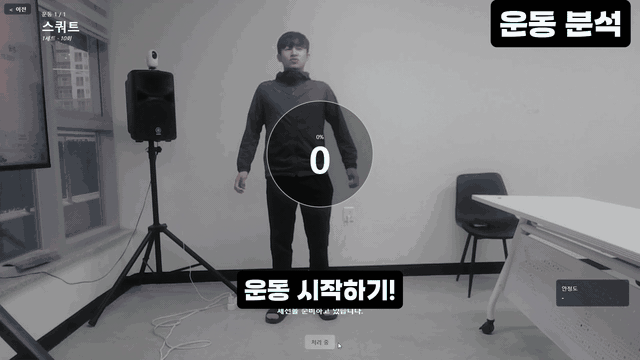
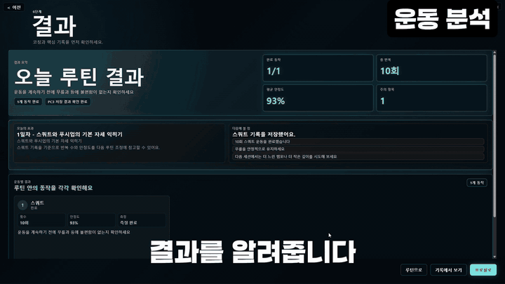

# 스마트 미러 AIoT 운동 코칭 통합 저장소

PC1 화면, PC3 비전 게이트웨이, PC2 AI 코칭 서버를 한 저장소에서 실행하고 발표할 수 있도록 묶은 스마트 미러 통합본입니다.

```text
PC1 Smart Mirror UI -> PC3 Vision Gateway -> PC2 NVIDIA/RAG Coaching Engine
```

PC1은 사용자 화면과 카메라 흐름을 담당하고, PC3는 자세 분석과 사용자 데이터 저장을 담당하며, PC2는 루틴과 코칭 JSON을 생성합니다. PC1은 PC2를 직접 호출하지 않고 PC3만 바라봅니다.

## 시연

### 프로필 입력과 루틴 생성


### 실시간 운동 분석



### 기록 확인과 2일차 운동



원본 시연 영상은 GitHub 일반 파일 한도를 넘기 때문에 저장소에는 올리지 않고, README에는 압축된 GIF만 포함했습니다.

## 구성

| 구분 | 폴더 | 역할 | 원본 저장소 |
| --- | --- | --- | --- |
| PC1 | `pc1-smart-mirror` | Tauri/React 기반 스마트 미러 UI, 프로필, baseline, 운동 화면 | [dpgns9983-dot/smart-mirror-exercise-only](https://github.com/dpgns9983-dot/smart-mirror-exercise-only) |
| PC2 | `pc2-smart-mirror-aiot-coaching` | NVIDIA/RAG 기반 루틴 생성, 운동 후 코칭 생성 | [tmdwn0196-osj/smart-mirror-aiot-coaching](https://github.com/tmdwn0196-osj/smart-mirror-aiot-coaching) |
| PC3 | `pc3-vision-gateway` | MediaPipe 자세 분석, WebSocket, 사용자 기록 저장, PC1/PC2 연동 | [rad1092/smart-mirror-aiot-coaching](https://github.com/rad1092/smart-mirror-aiot-coaching) |

## 발표 자료

- [PowerPoint 발표자료](docs/presentation/groom.pptx)
- [PDF 발표자료](docs/presentation/2조.pdf)

## 기여자

| 담당 | GitHub |
| --- | --- |
| PC1 UI/운동 화면 | [dpgns9983-dot](https://github.com/dpgns9983-dot) |
| PC2 AI 코칭 서버 | [tmdwn0196-osj](https://github.com/tmdwn0196-osj) |
| PC3 비전 게이트웨이/통합 저장소 | [rad1092](https://github.com/rad1092) |

## 폴더 구조

```text
.
├── pc1-smart-mirror/
├── pc2-smart-mirror-aiot-coaching/
├── pc3-vision-gateway/
├── docs/
│   ├── assets/
│   └── presentation/
├── PC123_CONNECTION.md
├── run-pc123-local.ps1
├── stop-pc123-local.ps1
└── test-pc123-local.ps1
```

## 실행 전 설정

각 폴더의 `.env.example`을 기준으로 로컬 `.env`를 만들어 실행합니다. `.env`, SQLite DB, 로그, `node_modules`, `.venv`, 빌드 결과물은 저장소에 올리지 않습니다.

기본 로컬 포트:

```text
PC1 UI: http://localhost:1420
PC2 API: http://127.0.0.1:7000
PC3 API: http://127.0.0.1:9000
```

같은 장비에서 세 구성요소를 확인할 때는 루트 스크립트를 사용할 수 있습니다.

```powershell
.\run-pc123-local.ps1
.\test-pc123-local.ps1
.\stop-pc123-local.ps1
```

세부 실행 방법과 API 계약은 각 하위 폴더의 README와 [PC123_CONNECTION.md](PC123_CONNECTION.md)를 참고합니다.
